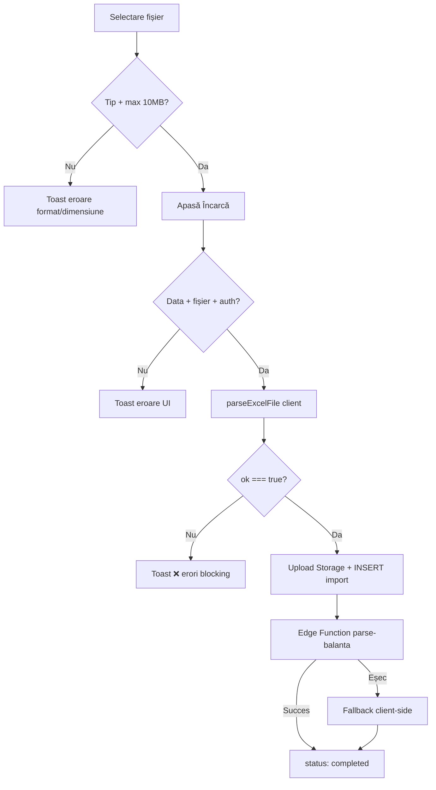

# Verificări și mesaje la upload balanță (finguardv2)

Document generat din analiza codului sursă: `IncarcareBalanta.tsx`, `useTrialBalances.tsx`, `excel-parser.ts`, `importPipeline.ts`, `balanceValidation.ts`, Edge Function `parse-balanta`.

---

## Flux general

```
UI → parseExcelFile (client, blocking) → Storage → DB → Edge Function parse-balanta (sau fallback client)
```

Validările stricte care **blochează** upload-ul rulează în browser, în `excel-parser.ts`, **înainte** de upload în Supabase.

---

## 1. Verificări în UI (`IncarcareBalanta.tsx`)

### La selectarea fișierului (drag & drop / browse)

| Verificare | Condiție | Mesaj |
|---|---|---|
| Tip fișier | Doar `.xlsx` / `.xls` (MIME) | `Format fișier neacceptat. Vă rugăm să încărcați un fișier Excel (.xlsx, .xls)` |
| Dimensiune | Max **10 MB** | `Fișierul depășește dimensiunea maximă de 10MB` |
| Succes | Fișier valid | `Fișier selectat cu succes!` |

### La apăsarea „Încarcă balanța”

| Verificare | Mesaj |
|---|---|
| Data de referință lipsă | `Data de referință este obligatorie` (+ text sub câmp: același mesaj) |
| Fișier lipsă | `Vă rugăm să selectați un fișier` |
| Utilizator neautentificat | `Trebuie să fiți autentificat` |
| Profil `users` negăsit | `Eroare profil utilizator: …` sau `Eroare la încărcare. Vă rugăm să încercați din nou.` |

### În timpul procesării / după

| Situație | Mesaj |
|---|---|
| Procesare server | `Procesare balanță pe server...` (toast info) |
| Succes | `Balanța a fost încărcată și procesată cu succes!` |
| Eroare validare (conține `❌`) | Prima linie din mesajul formatat, toast **8 secunde** |
| Eroare generică | Mesajul erorii sau `Eroare la încărcare` |
| Progress bar | `Se procesează... {n}%` |

### Alte mesaje UI (acțiuni secundare)

| Acțiune | Mesaj succes | Mesaj eroare |
|---|---|---|
| Ștergere balanță | `Balanța a fost ștearsă cu succes` | `Eroare la ștergere` |
| Retry import eșuat | `Balanța a fost reprocesată cu succes!` | `Eroare la reprocesare` / mesaj eroare |
| Retry — fără auth | — | `Trebuie să fiți autentificat` |
| Retry — user negăsit | — | `Eroare la identificarea utilizatorului` |
| Vizualizare conturi | — | `Eroare la încărcarea conturilor` |
| Descărcare fișier | — | `Fișierul nu este disponibil` / `Eroare la descărcare` |

---

## 2. Verificări blocking în parser Excel (`excel-parser.ts`) — v2.0

Rulează în `useTrialBalances.uploadBalance()` **înainte** de Storage/DB. Dacă `parseResult.ok === false`, upload-ul se oprește complet.

### A. Structură fișier

| Cod | Verificare | Mesaj |
|---|---|---|
| `EXCEL_NO_SHEETS` | Workbook fără foi | `Fișierul Excel nu conține foi de lucru` |
| `EXCEL_INSUFFICIENT_DATA` | < 2 rânduri (header + date) | `Fișierul nu conține date suficiente (minim 2 rânduri: header + date)` |
| `EXCEL_INVALID_COLUMN_COUNT` | Date dincolo de coloana H (coloana I+) | `Fișierul nu respectă structura de 8 coloane (…). {N} rând(uri) cu coloane suplimentare (date dincolo de coloana H).` |
| `EXCEL_PARSE_EXCEPTION` | Excepție la parsare | `Eroare la parsarea fișierului: {detaliu}` |
| `BALANCE_NO_VALID_ACCOUNTS` | Zero conturi valide după parsare | `Nu s-au găsit conturi valide în fișier` |

Eroare per rând (coloane):

| Cod | Mesaj (exemplu) |
|---|---|
| `BALANCE_ROW_INVALID_COLUMN_COUNT` | `Rândul {n}: … detectate date suplimentare dincolo de coloana H` |

**Celule goale (blank):** coloanele C–H lipsă sau goale sunt **normalizate la 0** la parsare. Nu generează eroare de structură.

### B. Validări per rând (coloane A–H)

Prima linie = header (ignorată). Rândurile complet goale sunt **ignorate** (fără eroare).

| Cod | Verificare | Mesaj (exemplu) |
|---|---|---|
| `BALANCE_ROW_ACCOUNT_MISSING` | Coloana A goală | `Rândul {n}: Cont lipsă (coloana A este goală)` |
| `BALANCE_ROW_ACCOUNT_INVALID` | Cont nu e 3–6 cifre (`/^\d{3,6}$/`) | `Rândul {n}: Cont invalid "{cod}" (așteptat 3-6 cifre)` |
| `BALANCE_ROW_NAME_TOO_LONG` | Denumire > 200 caractere | `Rândul {n}: Denumire prea lungă (max 200 caractere)` |
| `BALANCE_ROW_CLASS6_CLOSING_NOT_ZERO` | Cont 6xx, SF D sau SF C ≠ 0 | `Rândul {n}: Cont {cod} (clasa 6): sold final trebuie să fie zero (SF Debit: …, SF Credit: …)` |
| `BALANCE_ROW_CLASS7_CLOSING_NOT_ZERO` | Cont 7xx, SF D sau SF C ≠ 0 | `Rândul {n}: Cont {cod} (clasa 7): sold final trebuie să fie zero (SF Debit: …, SF Credit: …)` |

Dacă există erori de rând → se adaugă blocking error:

| Cod | Mesaj |
|---|---|
| `BALANCE_INVALID_ROWS_DETECTED` | `{N} rând(uri) cu erori detectate: conturi lipsă sau invalide` |

### C. Control total (blocking)

Prag rotunjire: **0.01 RON** (1 ban). Toate cele 3 verificări folosesc `applyBalanceControlCheck()`.

| Cod | Verificare | Mesaj |
|---|---|---|
| `BALANCE_CONTROL_OPENING_MISMATCH` | `\|Total SI Debit − Total SI Credit\| > 0.01 RON` | `Total Sold inițial Debit nu este egal cu Total Sold inițial Credit (diferență: {X} RON)` |
| `BALANCE_CONTROL_TURNOVER_MISMATCH` | `\|Total Rulaj D − Total Rulaj C\| > 0.01 RON` | `Total Rulaj curent Debit nu este egal cu Total Rulaj curent Credit (diferență: {X} RON)` |
| `BALANCE_CONTROL_TOTAL_MISMATCH` | `\|Total SF Debit − Total SF Credit\| > 0.01 RON` | `Total Sold final Debit nu este egal cu Total Sold final Credit (diferență: {X} RON)` |
| `BALANCE_CONTROL_CLASS6_CLOSING_NOT_ZERO` | Cont 6xx cu SF Debit sau SF Credit ≠ 0 (toleranță 0.01) | `Conturile clasa 6 (6xx) trebuie să aibă sold final zero. {N} cont(uri) cu sold final nenul detectate.` |
| `BALANCE_CONTROL_CLASS7_CLOSING_NOT_ZERO` | Cont 7xx cu SF Debit sau SF Credit ≠ 0 (toleranță 0.01) | `Conturile clasa 7 (7xx) trebuie să aibă sold final zero. {N} cont(uri) cu sold final nenul detectate.` |

### D. Sanitizare / limite implicite (fără mesaj separat)

- **Celule goale** în coloanele numerice (C–H): tratate ca **0** (`normalizeRowToEightColumns` + `parseNumber`)
- Rândurile cu cont valid dar fără valori numerice complete: coloanele lipsă = 0
- String max **500** caractere (trunchiat)
- Eliminare formula injection (`=`, `+`, `-`, `@`)
- Numere: format RO/US, max **±999.999.999.999,99**
- Max **10.000** conturi (restul ignorate)

### Structura coloanelor așteptate

| Coloană | Câmp |
|---|---|
| A | Cont |
| B | Denumire |
| C | SI Debit |
| D | SI Credit |
| E | Rulaj D |
| F | Rulaj C |
| G | SF Debit |
| H | SF Credit |

---

## 3. Warnings (nu blochează upload-ul)

| Cod | Condiție | Mesaj |
|---|---|---|
| `BALANCE_CONTROL_OPENING_ROUNDING_DIFF` | Diferență SI D/C ≤ 0.01 RON, dar > 0 | `Diferență minimă de rotunjire la sold inițial detectată ({X} RON) - acceptată` |
| `BALANCE_CONTROL_TURNOVER_ROUNDING_DIFF` | Diferență Rulaj D/C ≤ 0.01 RON, dar > 0 | `Diferență minimă de rotunjire la rulaje detectată ({X} RON) - acceptată` |
| `BALANCE_CONTROL_ROUNDING_DIFF` | Diferență SF D/C ≤ 0.01 RON, dar > 0 | `Diferență minimă de rotunjire la sold final detectată ({X} RON) - acceptată` |
| `DUPLICATE_ACCOUNTS` | Coduri cont duplicate | `{N} cod(uri) duplicate detectate. Vor fi agregate automat la încărcare.` |
| `MAX_ACCOUNTS_LIMIT_REACHED` | > 10.000 conturi | `Limita de 10000 conturi atinsă, restul rândurilor au fost ignorate` |

---

## 4. Formatarea erorilor pentru UI (`importPipeline.ts`)

`formatBlockingValidationErrors()` construiește mesajul afișat în toast.

### Eroare echilibru sold inițial

```
❌ Total Sold inițial Debit nu este egal cu Total Sold inițial Credit (diferență: X RON)
  • Sold inițial Debit: X RON
  • Sold inițial Credit: Y RON
  • Diferență: Z RON
```

### Eroare echilibru rulaje

```
❌ Total Rulaj curent Debit nu este egal cu Total Rulaj curent Credit (diferență: X RON)
  • Rulaj curent Debit: X RON
  • Rulaj curent Credit: Y RON
  • Diferență: Z RON
```

### Eroare echilibru sold final

```
❌ Total Sold final Debit nu este egal cu Total Sold final Credit (diferență: X RON)
  • Sold final Debit: X RON
  • Sold final Credit: Y RON
  • Diferență: Z RON
```

### Eroare rânduri invalide

```
❌ {N} rând(uri) cu erori detectate: conturi lipsă sau invalide
  • Total rânduri invalide: N
  • Exemple erori:
    - Rândul 3: Cont lipsă (coloana A este goală)
    - Rândul 5: Cont invalid "ABC" (așteptat 3-6 cifre)
```

Primele **5** erori de rând sunt incluse în detalii.

### Eroare structură coloane (date dincolo de H)

```
❌ Fișierul nu respectă structura de 8 coloane (Cont, Denumire, SI Debit, …). 1 rând(uri) cu coloane suplimentare (date dincolo de coloana H).
  • Rânduri afectate: 1
  • Exemple:
    - Rândul 3: structura permite maximum 8 coloane; detectate date suplimentare dincolo de coloana H
```

**Notă:** un rând cu celule goale în C–H **nu** declanșează această eroare — valorile goale devin 0.

### Eroare clasa 6 / 7 — sold final nenul

```
❌ Conturile clasa 6 (6xx) trebuie să aibă sold final zero. 2 cont(uri) cu sold final nenul detectate.
  • Conturi afectate: 2
  • Exemple:
    - Rândul 5: Cont 6011 (clasa 6): sold final trebuie să fie zero (SF Debit: 150.00, SF Credit: 0.00)
```

---

## 5. Verificări server (Edge Function `parse-balanta`)

Rulează **după** ce clientul a trecut validarea. Validările sunt **mai permisive** decât pe client.

| Verificare | Comportament / mesaj |
|---|---|
| Autentificare JWT | `Unauthorized` / `Invalid token` |
| Rate limit | `Too many requests. Please try again later.` (max 10/oră) |
| `import_id` lipsă | `Missing import_id` |
| Import inexistent | `Import not found` |
| Fișier > 10 MB | DB: `Fișier prea mare (max 10MB)` |
| Download eșuat | DB: `Nu s-a putut descărca fișierul` |
| Prea multe foi | `Prea multe foi în fișier (max 10)` |
| Prea multe rânduri/coloane | `Prea multe rânduri…` / `Prea multe coloane…` |
| Parsare eșuată | Mesaje similare clientului |
| Rânduri invalide | **Ignorate silențios** (nu blochează ca pe client) |
| Echilibru SI / Rulaj / SF D = C | **Nu există** pe server (control totals doar client-side) |
| Utilizator negăsit | DB: `Utilizator negăsit în baza de date` |
| Procesare conturi eșuată | `Failed to process accounts` |

### Fallback client (`processAccountsClientSide`)

Dacă Edge Function eșuează:

- Agregare duplicate + normalizare solduri duale D+C
- Eroare la insert: DB `Eroare la salvarea conturilor: {mesaj Supabase}`
- Timeout polling: `Timeout: procesarea balanței a durat prea mult. Verificați lista de importuri sau reîncercați.`
- Status error: `Procesarea pe server a eșuat` / `Procesarea balanței a eșuat`

### Retry import eșuat

| Verificare | Mesaj |
|---|---|
| Fișier sursă lipsă | `Fișierul sursă nu este disponibil` |
| Download eșuat | `Nu s-a putut descărca fișierul: {mesaj}` |
| Validare client eșuată | Mesaj formatat cu `formatBlockingValidationErrors()` |

---

## 6. Status import în listă

| Status | Badge UI | Eroare afișată |
|---|---|---|
| `completed` | Procesat | — |
| `processing` | În procesare | — |
| `validated` | Validat | — |
| `error` | Eroare | `error_message` din DB (sub badge) |
| `draft` | Draft | — |

---

## 7. `balanceValidation.ts` — validări extinse (neconectate direct la upload)

Echilibrul SI / Rulaje / SF este acoperit de `excel-parser.ts` (`BALANCE_CONTROL_*_MISMATCH`).

Există **16 validări contabile** suplimentare în `validateBalance()`:

**Critice (blocante dacă ar fi conectate):**

1. Listă goală — `Balanța nu conține niciun cont. Verificați fișierul Excel.`
2. Echilibru solduri inițiale — acoperit de `BALANCE_CONTROL_OPENING_MISMATCH` în `excel-parser.ts` (blocking la upload)
3. Echilibru rulaje — acoperit de `BALANCE_CONTROL_TURNOVER_MISMATCH` în `excel-parser.ts` (blocking la upload)
4. Echilibru solduri finale — acoperit de `BALANCE_CONTROL_TOTAL_MISMATCH` în `excel-parser.ts` (blocking la upload)
5. Clase cont 1–7 — `Lipsesc clase de conturi: …` (warning)
6. Format conturi OMFP — `{N} cont(uri) cu format invalid.`
7. Valori numerice finite — `{N} cont(uri) cu valori numerice invalide (NaN, Infinity).`
8. Duplicate cod cont — warning sau error (depinde de `aggregateDuplicates`)

**Non-blocante (warnings/info):**

9. Solduri duale D+C — `{N} sold(uri) dual(e) detectat(e).`
10. Ecuație contabilă SI + Rulaj = SF — `{N} cont(uri) cu ecuație contabilă nerespectată.`
11. Conturi inactive — `{N} cont(uri) inactive detectat(e).`
12. Valori negative — `{N} cont(uri) cu valori negative detectat(e).`
13. Outliers (IQR) — `{N} cont(uri) cu valori anormale detectat(e).`
14. Denumiri duplicate — `{N} denumire(i) duplicate detectat(e).`
15. Ierarhie conturi — `{N} cont(uri) analitic(e) fără cont sintetic detectat(e).`
16. Completitudine date — `{N} cont(uri) cu denumire lipsă sau incompletă.`

Toleranță numerică: **±1 RON**.

**Important:** `validateBalance()` **nu este apelată** în fluxul actual de upload. Din acel modul se folosește doar `aggregateDuplicateAccounts()` la salvare.

---

## Diagramă flux verificări



---

## Rezumat practic

### Ce blochează upload-ul (client)

1. Fișier invalid (tip, dimensiune, structură Excel)
2. Cont lipsă / invalid / denumire prea lungă
3. **Total Sold inițial Debit ≠ Total Sold inițial Credit** (peste 0.01 RON)
4. **Total Rulaj curent Debit ≠ Total Rulaj curent Credit** (peste 0.01 RON)
5. **Total Sold Final Debit ≠ Total Sold Final Credit** (peste 0.01 RON)
6. **Conturi clasa 6 (6xx) sau 7 (7xx) cu sold final nenul**
7. **Date în coloana I sau mai departe** (peste structura A–H)
8. Zero conturi valide

### Ce nu blochează, dar avertizează

- Rotunjiri minime (≤ 0.01 RON)
- Conturi duplicate (agregate automat)
- Limită 10.000 conturi

### Ce acceptă fără eroare (normalizare automată)

- **Celule goale / blank** în coloanele C–H → interpretate ca **0**
- Rânduri cu doar cont + denumire completate; restul coloanelor numerice lipsă → 0

### Unde apar mesajele

- Toast-uri Sonner (succes / eroare / info)
- Mesaj inline sub câmpul „Data de referință”
- `error_message` în tabelul „Balanțe Încărcate” pentru importuri cu status `error`
- Detalii complete erori validare în consola browser (când mesajul conține `❌`)

---

## Fișiere sursă relevante

| Fișier | Rol |
|---|---|
| `src/pages/IncarcareBalanta.tsx` | UI upload, toast-uri, validări pre-upload |
| `src/hooks/useTrialBalances.tsx` | Orchestrare flux upload |
| `src/lib/excel-parser.ts` | Parsare + validări blocking v2.0 |
| `src/lib/importPipeline.ts` | Formatare erori, procesare server/fallback |
| `src/utils/balanceValidation.ts` | 16 validări contabile (neconectate la upload) |
| `supabase/functions/parse-balanta/index.ts` | Procesare server-side |
