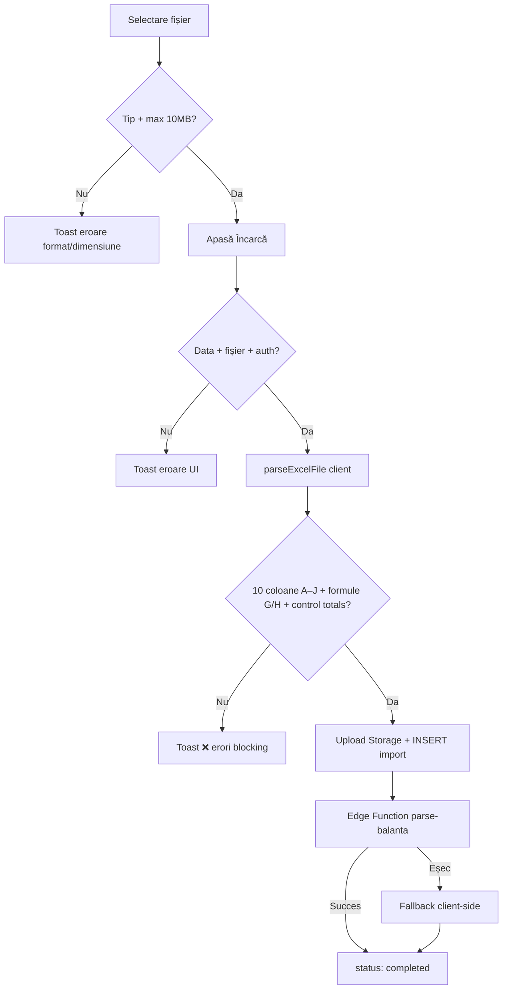

# Verificări și mesaje la upload balanță (finguardv2)

Document generat din analiza codului sursă: `IncarcareBalanta.tsx`, `useTrialBalances.tsx`, `excel-parser.ts`, `importPipeline.ts`, `balanceValidation.ts`, Edge Function `parse-balanta`.

**Versiune format:** v2.1 — **10 coloane obligatorii (A–J)**  
**Ultima actualizare:** Iunie 2026

---

## Flux general

```
UI → parseExcelFile (client, blocking) → Storage → DB → Edge Function parse-balanta (sau fallback client)
```

Validările stricte care **blochează** upload-ul rulează în browser, în `excel-parser.ts`, **înainte** de upload în Supabase. Edge Function aplică aceleași reguli de structură și formule (aliniere client/server).

---

## Structura Excel obligatorie (10 coloane A–J)

| Coloană | Câmp DB / parser | Descriere |
|---------|------------------|-----------|
| A | `account_code` | Cont (3–6 cifre) |
| B | `account_name` | Denumire (max 200 caractere) |
| C | `opening_debit` | SI Debit |
| D | `opening_credit` | SI Credit |
| E | `debit_turnover` | Rulaj D |
| F | `credit_turnover` | Rulaj C |
| G | `total_sume_debitoare` | **Total sume debitoare** = SI Debit + Rulaj D |
| H | `total_sume_creditoare` | **Total sume creditoare** = SI Credit + Rulaj C |
| I | `closing_debit` | SF Debit |
| J | `closing_credit` | SF Credit |

**Reguli structură:**
- Aplicația **NU** acceptă formatul vechi cu 8 coloane (A–H, unde G/H erau SF).
- Structura acceptată: **exact 10 coloane A–J**.
- Date dincolo de coloana **J** (K+) → upload blocat.
- Fișier cu date doar până la coloana H → `EXCEL_LEGACY_8_COLUMN_FORMAT`.
- Lipsesc coloane I/J din structura foii → `EXCEL_MISSING_REQUIRED_COLUMNS`.

**Formule blocking (toleranță 0,01 RON):**
- `total_sume_debitoare = SI_DEBIT + rulaj_d`
- `total_sume_creditoare = SI_CREDIT + rulaj_c`

---

## 1. Verificări în UI (`IncarcareBalanta.tsx`)

### La selectarea fișierului (drag & drop / browse)

| Verificare | Condiție | Mesaj |
|---|---|---|
| Tip fișier | Doar `.xlsx` / `.xls` (MIME) | `Format fișier neacceptat. Vă rugăm să încărcați un fișier Excel (.xlsx, .xls)` |
| Dimensiune | Max **10 MB** | `Fișierul depășește dimensiunea maximă de 10MB` |
| Succes | Fișier valid | `Fișier selectat cu succes!` |

### La apăsarea „Încarcă balanța”

| Verificare | Mesaj |
|---|---|
| Data de referință lipsă | `Data de referință este obligatorie` (+ text sub câmp: același mesaj) |
| Fișier lipsă | `Vă rugăm să selectați un fișier` |
| Utilizator neautentificat | `Trebuie să fiți autentificat` |
| Profil `users` negăsit | `Eroare profil utilizator: …` sau `Eroare la încărcare. Vă rugăm să încercați din nou.` |

### În timpul procesării / după

| Situație | Mesaj |
|---|---|
| Procesare server | `Procesare balanță pe server...` (toast info) |
| Succes | `Balanța a fost încărcată și procesată cu succes!` |
| Eroare validare (conține `❌`) | Prima linie din mesajul formatat, toast **8 secunde** |
| Eroare generică | Mesajul erorii sau `Eroare la încărcare` |
| Progress bar | `Se procesează... {n}%` |

### Ghid upload (UI)

Textele din pagină reflectă formatul **10 coloane**:
- Coloane A–J cu Total sume debitoare / Total sume creditoare în G/H, SF în I/J
- Regulă: structura veche cu 8 coloane nu mai este acceptată
- Date dincolo de coloana J resping upload-ul

### Alte mesaje UI (acțiuni secundare)

| Acțiune | Mesaj succes | Mesaj eroare |
|---|---|---|
| Ștergere balanță | `Balanța a fost ștearsă cu succes` | `Eroare la ștergere` |
| Retry import eșuat | `Balanța a fost reprocesată cu succes!` | `Eroare la reprocesare` / mesaj eroare |
| Retry — fără auth | — | `Trebuie să fiți autentificat` |
| Retry — user negăsit | — | `Eroare la identificarea utilizatorului` |
| Vizualizare conturi | — | `Eroare la încărcarea conturilor` (tabel afișează și coloanele Tot. Debit / Tot. Credit) |
| Descărcare fișier | — | `Fișierul nu este disponibil` / `Eroare la descărcare` |

---

## 2. Verificări blocking în parser Excel (`excel-parser.ts`) — v2.1

Rulează în `useTrialBalances.uploadBalance()` **înainte** de Storage/DB. Dacă `parseResult.ok === false`, upload-ul se oprește complet și **nu** se inserează conturi.

### A. Structură fișier

| Cod | Verificare | Mesaj (rezumat) |
|---|---|---|
| `EXCEL_NO_SHEETS` | Workbook fără foi | `Fișierul Excel nu conține foi de lucru` |
| `EXCEL_INSUFFICIENT_DATA` | < 2 rânduri (header + date) | `Fișierul nu conține date suficiente (minim 2 rânduri: header + date)` |
| `EXCEL_LEGACY_8_COLUMN_FORMAT` | Date doar până la coloana H (format vechi) | `Structura veche cu 8 coloane (A–H) nu mai este acceptată…` |
| `EXCEL_MISSING_REQUIRED_COLUMNS` | Lipsesc coloane I/J din structura foii | `Fișierul nu conține toate coloanele obligatorii A–J…` |
| `EXCEL_INVALID_COLUMN_COUNT` | Date dincolo de coloana J (K+) | `Fișierul nu respectă structura de 10 coloane… date dincolo de coloana J` |
| `EXCEL_PARSE_EXCEPTION` | Excepție la parsare | `Eroare la parsarea fișierului: {detaliu}` |
| `BALANCE_NO_VALID_ACCOUNTS` | Zero conturi valide după parsare | `Nu s-au găsit conturi valide în fișier` |

Eroare per rând (structură):

| Cod | Mesaj (exemplu) |
|---|---|
| `BALANCE_ROW_INVALID_COLUMN_COUNT` | `Rândul {n}: … detectate date suplimentare dincolo de coloana J` |

**Celule goale (blank):** coloanele C–J lipsă sau goale sunt **normalizate la 0** (`normalizeRowToTenColumns` + `parseNumber`). Nu generează eroare de structură dacă fișierul respectă formatul A–J.

### B. Validări per rând (coloane A–J)

Prima linie = header (ignorată). Rândurile complet goale sunt **ignorate** (fără eroare).

| Cod | Verificare | Mesaj (exemplu) |
|---|---|---|
| `BALANCE_ROW_ACCOUNT_MISSING` | Coloana A goală | `Rândul {n}: Cont lipsă (coloana A este goală)` |
| `BALANCE_ROW_ACCOUNT_INVALID` | Cont nu e 3–6 cifre | `Rândul {n}: Cont invalid "{cod}" (așteptat 3-6 cifre)` |
| `BALANCE_ROW_NAME_TOO_LONG` | Denumire > 200 caractere | `Rândul {n}: Denumire prea lungă (max 200 caractere)` |
| `BALANCE_ROW_TOTAL_DEBIT_SUM_MISMATCH` | G ≠ SI Debit + Rulaj D | `Rândul {n}: total_sume_debitoare nu corespunde formulei SI_DEBIT + rulaj_d…` |
| `BALANCE_ROW_TOTAL_CREDIT_SUM_MISMATCH` | H ≠ SI Credit + Rulaj C | `Rândul {n}: total_sume_creditoare nu corespunde formulei SI_CREDIT + rulaj_c…` |
| `BALANCE_ROW_CLASS6_CLOSING_NOT_ZERO` | Cont 6xx, SF I/J ≠ 0 | `Rândul {n}: Cont {cod} (clasa 6): sold final trebuie să fie zero…` |
| `BALANCE_ROW_CLASS7_CLOSING_NOT_ZERO` | Cont 7xx, SF I/J ≠ 0 | `Rândul {n}: Cont {cod} (clasa 7): sold final trebuie să fie zero…` |

Erori agregate (blocking):

| Cod | Mesaj |
|---|---|
| `BALANCE_TOTAL_SUMS_MISMATCH_DETECTED` | `{N} rând(uri) cu total_sume_debitoare / total_sume_creditoare calculate incorect. Upload-ul a fost blocat.` |
| `BALANCE_INVALID_ROWS_DETECTED` | `{N} rând(uri) cu erori detectate: conturi lipsă sau invalide` |

Detalii per eroare total_sume (în `rowErrors[].details`):
- `rowIndex`, `account_code`, `field`, `expectedValue`, `actualValue`, `difference`, `formula`

### C. Control total (blocking)

Prag rotunjire: **0.01 RON** (1 ban). Toate verificările folosesc `applyBalanceControlCheck()`.

| Cod | Verificare | Mesaj |
|---|---|---|
| `BALANCE_CONTROL_OPENING_MISMATCH` | `\|Total SI Debit − Total SI Credit\| > 0.01 RON` | `Total Sold inițial Debit nu este egal cu Total Sold inițial Credit (diferență: {X} RON)` |
| `BALANCE_CONTROL_TURNOVER_MISMATCH` | `\|Total Rulaj D − Total Rulaj C\| > 0.01 RON` | `Total Rulaj curent Debit nu este egal cu Total Rulaj curent Credit (diferență: {X} RON)` |
| `BALANCE_CONTROL_TOTAL_MISMATCH` | `\|Total SF Debit − Total SF Credit\| > 0.01 RON` | `Total Sold final Debit nu este egal cu Total Sold final Credit (diferență: {X} RON)` |
| `BALANCE_CONTROL_CLASS6_CLOSING_NOT_ZERO` | Cont 6xx cu SF ≠ 0 | `Conturile clasa 6 (6xx) trebuie să aibă sold final zero…` |
| `BALANCE_CONTROL_CLASS7_CLOSING_NOT_ZERO` | Cont 7xx cu SF ≠ 0 | `Conturile clasa 7 (7xx) trebuie să aibă sold final zero…` |

### D. Sanitizare / limite implicite (fără mesaj separat)

- **Celule goale** în coloanele numerice (C–J): tratate ca **0**
- String max **500** caractere (trunchiat)
- Eliminare formula injection (`=`, `+`, `-`, `@`)
- Numere: format RO/US, max **±999.999.999.999,99**
- Max **10.000** conturi (restul ignorate)

---

## 3. Warnings (nu blochează upload-ul)

| Cod | Condiție | Mesaj |
|---|---|---|
| `BALANCE_CONTROL_OPENING_ROUNDING_DIFF` | Diferență SI D/C ≤ 0.01 RON, dar > 0 | `Diferență minimă de rotunjire la sold inițial detectată ({X} RON) - acceptată` |
| `BALANCE_CONTROL_TURNOVER_ROUNDING_DIFF` | Diferență Rulaj D/C ≤ 0.01 RON, dar > 0 | `Diferență minimă de rotunjire la rulaje detectată ({X} RON) - acceptată` |
| `BALANCE_CONTROL_ROUNDING_DIFF` | Diferență SF D/C ≤ 0.01 RON, dar > 0 | `Diferență minimă de rotunjire la sold final detectată ({X} RON) - acceptată` |
| `DUPLICATE_ACCOUNTS` | Coduri cont duplicate | `{N} cod(uri) duplicate detectate. Vor fi agregate automat la încărcare.` |
| `MAX_ACCOUNTS_LIMIT_REACHED` | > 10.000 conturi | `Limita de 10000 conturi atinsă, restul rândurilor au fost ignorate` |

---

## 4. Formatarea erorilor pentru UI (`importPipeline.ts`)

`formatBlockingValidationErrors()` construiește mesajul afișat în toast.

### Eroare total_sume incorect (G/H)

```
❌ 3 rând(uri) cu total_sume_debitoare / total_sume_creditoare calculate incorect. Upload-ul a fost blocat.
  • Total rânduri afectate: 3
  • Exemple:
    - Rândul 12, cont 401: total_sume_creditoare trebuie să fie SI_CREDIT + rulaj_c
      Valoare fișier: 1200.00 RON
      Valoare calculată: 1300.00 RON
      Diferență: 100.00 RON
```

### Eroare format vechi 8 coloane

```
❌ Structura veche cu 8 coloane (A–H) nu mai este acceptată. Aplicația acceptă exclusiv balanțe cu 10 coloane (A–J): …
  • Așteptat: 10 coloane, detectat: 8
```

### Eroare structură coloane (date dincolo de J)

```
❌ Fișierul nu respectă structura de 10 coloane (Cont, Denumire, SI Debit, …). 1 rând(uri) cu coloane suplimentare (date dincolo de coloana J).
  • Rânduri afectate: 1
  • Exemple:
    - Rândul 3: structura permite exact 10 coloane; detectate date suplimentare dincolo de coloana J
```

### Erori echilibru SI / Rulaj / SF

Format identic cu versiunea anterioară (vezi secțiunea 4 din documentația v2.0).

---

## 5. Verificări server (Edge Function `parse-balanta`) — v2.1

Rulează **după** upload în Storage. Validările de structură, formule G/H și control totals sunt **aliniate cu clientul** (nu mai sunt permisive).

| Verificare | Comportament / mesaj |
|---|---|
| Autentificare JWT | `Unauthorized` / `Invalid token` |
| Rate limit | `Too many requests. Please try again later.` (max 10/oră) |
| `import_id` lipsă | `Missing import_id` |
| Import inexistent | `Import not found` |
| Fișier > 10 MB | DB: `Fișier prea mare (max 10MB)` |
| Download eșuat | DB: `Nu s-a putut descărca fișierul` |
| Format vechi 8 coloane | `EXCEL_LEGACY_8_COLUMN_FORMAT` → status `error` |
| Coloane lipsă / date peste J | `EXCEL_MISSING_REQUIRED_COLUMNS` / `EXCEL_INVALID_COLUMN_COUNT` |
| total_sume G/H incorect | `BALANCE_TOTAL_SUMS_MISMATCH_DETECTED` |
| Echilibru SI / Rulaj / SF | `BALANCE_CONTROL_MISMATCH` |
| Clasa 6/7 SF nenul | inclus în validare server |
| Payload RPC | Include `total_sume_debitoare`, `total_sume_creditoare` |
| Utilizator negăsit | DB: `Utilizator negăsit în baza de date` |
| Procesare conturi eșuată | `Failed to process accounts` |

### Persistență DB

Migrare `20260621100000_add_total_sume_columns.sql`:
- Coloane noi: `trial_balance_accounts.total_sume_debitoare`, `total_sume_creditoare`
- `process_import_accounts`, `get_balances_with_accounts`, `get_accounts_paginated` actualizate

### Fallback client (`processAccountsClientSide`)

Dacă Edge Function eșuează:
- Agregare duplicate + normalizare solduri duale D+C
- Insert include câmpurile `total_sume_*`
- Eroare la insert: DB `Eroare la salvarea conturilor: {mesaj Supabase}`

### Retry import eșuat

Revalidare client cu `parseExcelFile` — același format 10 coloane obligatoriu.

---

## 6. Status import în listă

| Status | Badge UI | Eroare afișată |
|---|---|---|
| `completed` | Procesat | — |
| `processing` | În procesare | — |
| `validated` | Validat | — |
| `error` | Eroare | `error_message` din DB (sub badge) |
| `draft` | Draft | — |

---

## 7. `balanceValidation.ts` — validări extinse (neconectate direct la upload)

Echilibrul SI / Rulaje / SF și formulele G/H sunt acoperite de `excel-parser.ts`.

Există **16 validări contabile** suplimentare în `validateBalance()` (toleranță ±1 RON). **Nu sunt apelate** în fluxul actual de upload; se folosește doar `aggregateDuplicateAccounts()` (inclusiv sumare `total_sume_*` la duplicate).

---

## 8. Teste automate

Fișier: `src/lib/excel-parser.test.ts` (Vitest)

```bash
npm test
```

Scenarii acoperite: accept 10 coloane, respingere 8 coloane, date peste J, formule G/H, toleranță 0,01 RON, controale SI/Rulaj/SF, `ok === false` → `accounts = []`.

---

## Diagramă flux verificări



---

## Rezumat practic

### Ce blochează upload-ul (client)

1. Fișier invalid (tip, dimensiune, structură Excel)
2. **Format vechi 8 coloane** sau coloane lipsă / date peste J
3. Cont lipsă / invalid / denumire prea lungă
4. **total_sume_debitoare ≠ SI Debit + Rulaj D** (peste 0,01 RON)
5. **total_sume_creditoare ≠ SI Credit + Rulaj C** (peste 0,01 RON)
6. Total SI / Rulaj / SF dezechilibrate (peste 0,01 RON)
7. Conturi clasa 6/7 cu sold final nenul
8. Zero conturi valide

### Ce nu blochează, dar avertizează

- Rotunjiri minime (≤ 0,01 RON) la totaluri globale
- Conturi duplicate (agregate automat)
- Limită 10.000 conturi

### Ce acceptă fără eroare (normalizare automată)

- Celule goale în coloanele C–J → **0**
- Rânduri goale ignorate

### Unde apar mesajele

- Toast-uri Sonner
- Mesaj inline sub „Data de referință”
- `error_message` în lista balanțelor (status `error`)
- Tabel vizualizare conturi: coloane Tot. Debit / Tot. Credit + SF

---

## Fișiere sursă relevante

| Fișier | Rol |
|---|---|
| `src/pages/IncarcareBalanta.tsx` | UI upload, ghid 10 coloane, toast-uri |
| `src/hooks/useTrialBalances.tsx` | Orchestrare flux upload |
| `src/lib/excel-parser.ts` | Parsare + validări blocking v2.1 |
| `src/lib/importPipeline.ts` | Formatare erori, procesare server/fallback |
| `src/utils/balanceValidation.ts` | Agregare duplicate + validări extinse |
| `supabase/functions/parse-balanta/index.ts` | Procesare server-side aliniată |
| `supabase/migrations/20260621100000_add_total_sume_columns.sql` | Coloane DB + RPC |
| `src/lib/excel-parser.test.ts` | Teste Vitest |
